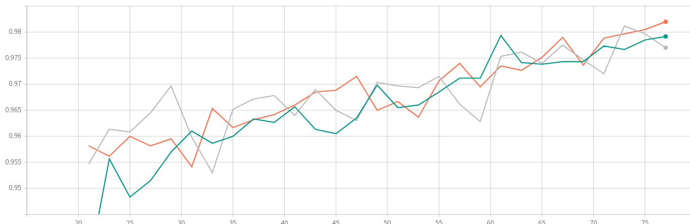
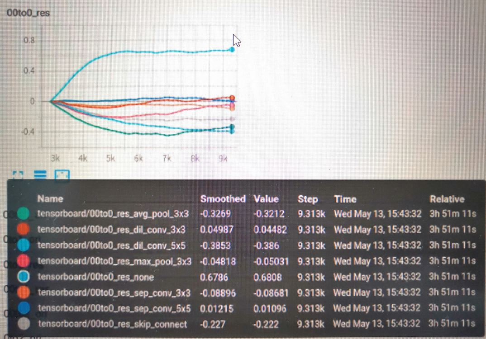
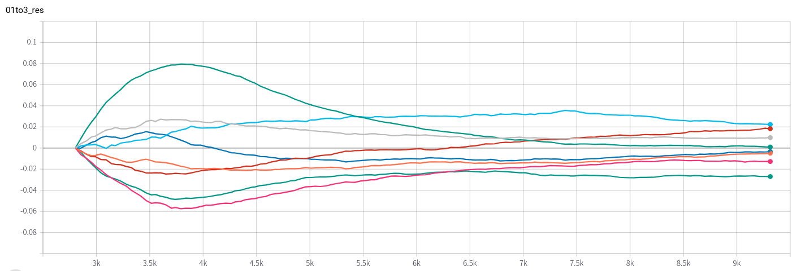

# PC-DARTS-LFW

- [Introduction](#Introduction)
- [Results](#Results)
- [Architecture parameters visualization](#visualization)
- [Usage](#Usage)
- [Reference](#Reference)

## Introduction

This repo is an application of PC-DARTS. We search architectures on Webface dataset and evaluate the model on LFW. Official version can be accepted from the link: [yuhuixu1993/PC-DARTS](https://github.com/yuhuixu1993/PC-DARTS)

In this repo, my works are as below:

- sample the proxy task to accelerate the search period
- design the stems to fit webface dataset resolution
- use multi-process to accelerate LFW evalution
- visualize the architecture parameters including alpha and beta by using tensorboard
- parameters adjustment

## Results
### BEST
We get LFW_ACC 98.58% after 20 epochs fine-tune with dropout 0.4 based on warmup-epoch-15 PC-DARTS-LFW pretrained model.  The result 98.38% of ResNet50 is reached after 30 epochs fine-tune with dropout 0.5 based on ImageNet pretrained model.

| Model        | LFW_ACC | Params |
| ------------ | ------- | ------ |
| PC-DARTS-LFW | 98.58%  | 13.04M |
| ResNet50     | 98.38%  | 25.5M  |

### Experiment
#### warmup epochs

| warmup epochs | LFW_ACC | Params | geno result                                                  |
| ------------- | ------- | ------ | ------------------------------------------------------------ |
| 10            | 97.93%  | 13.36M | Genotype(normal=[('sep_conv_5x5', 0), ('sep_conv_5x5', 1), ('sep_conv_5x5', 1), ('sep_conv_5x5', 2), ('sep_conv_5x5', 3), ('sep_conv_5x5', 1), ('sep_conv_5x5', 4), ('max_pool_3x3', 3)], normal_concat=range(2, 6), reduce=[('sep_conv_5x5', 1), ('sep_conv_3x3', 0), ('max_pool_3x3', 1), ('avg_pool_3x3', 0), ('max_pool_3x3', 1), ('sep_conv_3x3', 0), ('max_pool_3x3', 2), ('skip_connect', 1)], reduce_concat=range(2, 6)) |
| 15            | 98.2%   | 13.04M | Genotype(normal=[('sep_conv_5x5', 1), ('sep_conv_3x3', 0), ('sep_conv_5x5', 0), ('sep_conv_3x3', 2), ('sep_conv_5x5', 3), ('avg_pool_3x3', 2), ('sep_conv_3x3', 4), ('sep_conv_3x3', 1)], normal_concat=range(2, 6), reduce=[('max_pool_3x3', 1), ('max_pool_3x3', 0), ('max_pool_3x3', 1), ('max_pool_3x3', 2), ('sep_conv_5x5', 1), ('max_pool_3x3', 2), ('max_pool_3x3', 2), ('sep_conv_3x3', 3)], reduce_concat=range(2, 6)) |
| 25            | 97.93%  | 12.76M | Genotype(normal=[('sep_conv_5x5', 1), ('sep_conv_5x5', 0), ('sep_conv_5x5', 1), ('dil_conv_3x3', 0), ('sep_conv_5x5', 3), ('sep_conv_5x5', 1), ('sep_conv_5x5', 4), ('max_pool_3x3', 2)], normal_concat=range(2, 6), reduce=[('max_pool_3x3', 1), ('max_pool_3x3', 0), ('max_pool_3x3', 1), ('max_pool_3x3', 0), ('max_pool_3x3', 1), ('max_pool_3x3', 0), ('max_pool_3x3', 2), ('max_pool_3x3', 3)], reduce_concat=range(2, 6)) |




### experiment detail
#### search details
we get 10% Webface dataset to search. batch-size 128 case needs 20G memory. 
1 search epoch needs ~13 min. One time LFW evaluation needs ~16 min.

#### retrain details
total 80 epochs, initial learning rate 0.4, linear decay
data augmentation: color-jittor 0.4, label-smooth 0.2, random erase prob-0.9 mode-const count-1

## visualization

we visualize all architecture parameters including 8 alpha and 1 beta as below.



`[00, 01, 0, 1, 2, 3]` represents 6 nodes in a cell. `[00, 01]` is input nodes. `ori` represents alpha parameters. `res` represents 8  alphas multiplying betas, which determines which path is selected.

> Note: the same parameter line corresponds to different color.




## Usage

### Prepare
- Enviroment
    - torch1.3
- Dataset
    you can dowload Webface and LFW dataset from [Baidu WangPan](https://pan.baidu.com/s/1ji_9-xtlkMoXqNSfsKJThg) (password:030r)
    Then change the code-the augment about data path.
### Search

```
python train_search_face.py 
```

### retrain
Firstly, change your architechture in `genotypes.py` and then run `train_face.py`

```
python train_face.py 
```

## Reference
[yuhuixu1993/PC-DARTS](https://github.com/yuhuixu1993/PC-DARTS)

[rwightman/pytorch-image-models](https://github.com/rwightman/pytorch-image-models)
